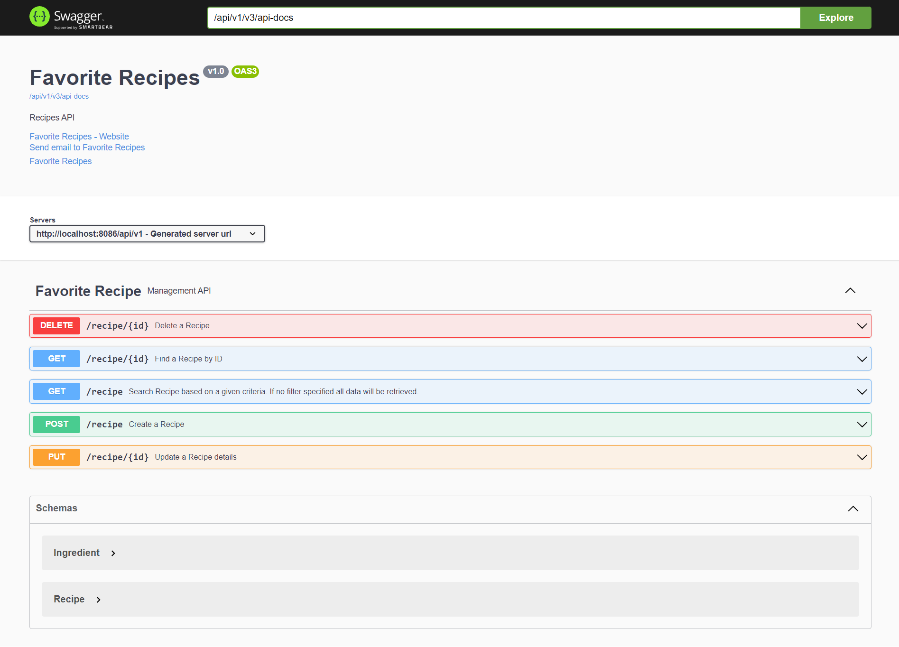

# FAVORITE RECIPE APP API
This project is created for managing data of favorite recipes.

# Description 
This application allow users to manage their favorite recipes by creating,fetching, updating and removing.
User can also filter their recipes based on the following criteria,
1. Whether the recipe is a Vegetarian or not by providing the search text as "yes" or "no".
2. Number of servings
3. Specific ingredient to include
4. Specific ingredient to exclude
5. Search a text in the instruction

# Minimal setup for the application

For building and running the application you need:

- [JDK 17 ](https://jdk.java.net/archive/)
- [MySQL 8 ](https://dev.mysql.com/downloads/mysql/)
- [Maven 3 ](https://maven.apache.org)


## Database: `favorite_recipe`
Create a MySQL database with the name `favorite_recipe`.
## Create Tables manually
For creating the tables, go to the `dbscript` folder inside the project folder and execute the `schema.sql` file against the database `favorite_recipe`

## Configure Datasource, JPA, Hibernate
Under `src/main/resources` folder, open `application.properties` and edit the below database properties with your local database properties.

```
spring.datasource.url= jdbc:mysql://localhost:3306/favorite_recipe
spring.datasource.username= admin
spring.datasource.password= admin
```
## Installation
The project is created with Maven, so you just need to import it to your IDE and build the project to resolve the dependencies.

## Running Tests

1.Run the JUnit test by using the command : `mvn test`

2. Navigate to the Jacoco folder and open ```target/site/jacoco/index.html```
3. ```index.html``` will list the coverage for the complete Project

**Coverage Indicators**
- Red    : Not Covered
- Yellow : Partially Covered
- Green  : Completely Covered

## Running the application locally

There are several ways to run this application on your local machine. 

One way is to execute the `main` method in the `com.favorite.recipes.FavoriteRecipeApplication` class from your IDE.

or

Open your command prompt and run the project by using the command : `mvn clean spring-boot:run`

## API documentation using Swagger

Open your browser with the URL below:

`http://localhost:8086/api/v1/swagger-ui/index.html`

All the API end points are documented in the controller and are self explanatory. Following are snapshot of the APIs created.



